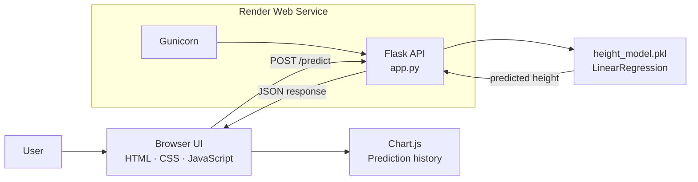
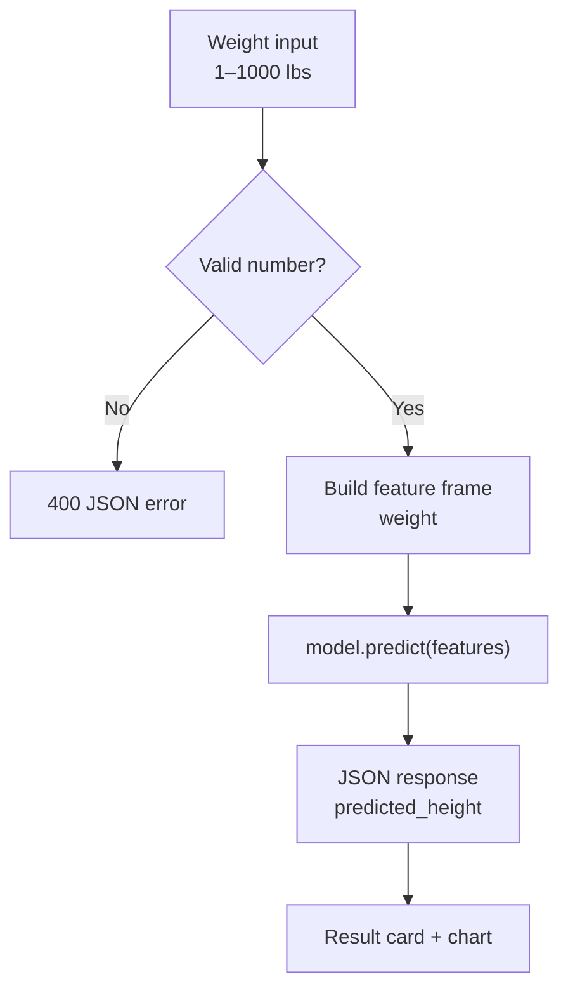

# HeightLab

> **A lightweight machine-learning height estimator built with Python and scikit-learn.**

[](https://heightpredictor.onrender.com) [](https://github.com/Samarssj/heightPredictor) [](https://github.com/Samarssj/heightPredictor)

HeightLab estimates a person’s height from their weight using a serialized **scikit-learn `LinearRegression` model**. The application combines a responsive browser interface with a Python-only Flask API, providing live inference from `height_model.pkl`, input validation, a health endpoint, dark mode, and a session-based prediction history chart.

## Preview

The interface is designed as a focused two-panel experience: enter a weight on the left, then explore the returned estimate and prediction history on the right.

> **Try it live:** [heightpredictor.onrender.com](https://heightpredictor.onrender.com)

## Technology stack

[](https://www.python.org/) [](https://flask.palletsprojects.com/) [](https://scikit-learn.org/)

[](https://gunicorn.org/) [](https://developer.mozilla.org/en-US/docs/Web/JavaScript) [](https://www.chartjs.org/) [](https://render.com/)

| Layer | Technologies | Responsibility |
|---|---|---|
| **Interface** | HTML, CSS, JavaScript, Chart.js | Collects weight input, presents the estimate, and plots session history. |
| **API** | Flask, Gunicorn | Serves the frontend and exposes `/predict` and `/health`. |
| **Machine learning** | scikit-learn, pandas, NumPy, joblib | Trains, serializes, loads, and executes the regression model. |
| **Deployment** | Render, `render.yaml` | Installs pinned dependencies and runs the Python web service. |

## Architecture



## How the prediction works



The trained artifact is loaded **once when the Gunicorn worker starts**. Each request passes a pandas feature frame with the same `weight` feature name used during training, then returns the model output rounded to two decimal places.

## Features

| Feature | Description |
|---|---|
| **Python-only inference** | Live predictions use `height_model.pkl` directly through Flask; no Node runtime or request-time subprocess is required. |
| **Responsive UI** | A mobile-friendly layout with light and dark themes, accessible labels, and clear loading states. |
| **Prediction history** | Every submitted weight and estimate remains visible in a Chart.js graph for the current browser session. |
| **Input validation** | The API accepts weights from 1 to 1000 pounds and returns readable JSON errors for invalid values. |
| **Health monitoring** | `GET /health` confirms that the model loaded and identifies the model type. |

## Project structure

```text
.
├── app.py                 # Flask API and static frontend server
├── public/index.html      # Responsive HeightLab interface
├── height_model.pkl       # Serialized scikit-learn model used in production
├── train_model.py         # Retrains height_model.pkl from the dataset
├── model.py               # Standalone model runner for local checks
├── SOCR-HeightWeight.csv  # Training dataset
├── requirements.txt       # Pinned Python dependencies
├── render.yaml            # Render Python service configuration
├── README.md              # Project documentation
└── .gitignore
```

## Quick start

Clone the repository and install the pinned dependencies:

```bash
git clone https://github.com/Samarssj/heightPredictor.git
cd heightPredictor
python3 -m pip install -r requirements.txt
```

Start the production-style local server with Gunicorn:

```bash
gunicorn app:app --bind 127.0.0.1:5000
```

Open [http://127.0.0.1:5000](http://127.0.0.1:5000) in a browser. To call the API directly:

```bash
curl -X POST http://127.0.0.1:5000/predict \
  -H 'Content-Type: application/json' \
  -d '{"weight":150}'
```

Example response:

```json
{
  "predicted_height": 69.87,
  "weight": 150.0
}
```

Check model readiness with:

```bash
curl http://127.0.0.1:5000/health
```

## Retrain the model

To train a new artifact from an updated dataset:

```bash
python3 train_model.py
```

The script overwrites `height_model.pkl`. Restart the Flask/Gunicorn service or redeploy the application so the new artifact is loaded. Keep the scikit-learn version aligned with `requirements.txt` when creating and loading the serialized model.

## Deploy with Render

The committed `render.yaml` describes the Python service:

```yaml
runtime: python
buildCommand: pip install -r requirements.txt
startCommand: gunicorn app:app --bind 0.0.0.0:$PORT
```

For a new Render service, select the repository and `main` branch, or create a Blueprint from the repository so Render can read `render.yaml`. After deployment, verify both endpoints:

```bash
curl https://YOUR-SERVICE.onrender.com/health
curl -X POST https://YOUR-SERVICE.onrender.com/predict \
  -H 'Content-Type: application/json' \
  -d '{"weight":150}'
```

## API reference

| Method | Endpoint | Purpose |
|---|---|---|
| `GET` | `/` | Serves the HeightLab frontend. |
| `GET` | `/health` | Confirms the model is loaded. |
| `POST` | `/predict` | Accepts `{ "weight": number }` and returns the estimated height. |

## Important note

> HeightLab is an educational estimate based on a simple regression model. It is not a medical measurement, diagnosis, or professional assessment.

## References

[1]: https://shields.io/ "Shields.io badge service"
[2]: https://docs.github.com/en/get-started/writing-on-github/working-with-advanced-formatting/creating-diagrams "GitHub Mermaid diagram documentation"
[3]: https://scikit-learn.org/stable/modules/generated/sklearn.linear_model.LinearRegression.html "scikit-learn LinearRegression documentation"
